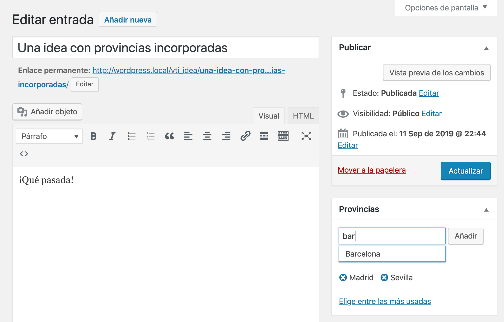

# kfp-geo-spain
Recursos toponímico/geográficos para WordPress

De momento sólo es una custom taxonomy con las provincias españolas.


## ¿Qué es una taxonomía de WordPress?
Si eres usuario de WordPress ya estás usando las taxonomías sin saberlo, cada vez que asignas una categoría o una etiqueta a una entrada estás utilizando una taxonomía. Por defecto WordPress trae esas dos únicas taxonomías: categorías y etiqueta. Las categorías son jerárquicas, puedes hacer que unas categorías dependan de otros, las etiquetas no son jerárquicas. Con estos dos tipos casi cualquier web puede solucionar todos sus requisitos pero si estás desarrollando una solución más personalizada sería preferible utilizar taxonomías personalizadas (Custom Taxonomies). 

Las taxonomías personalizadas se almacenan en las mismas tablas que las taxonomías predeterminadas. Al igual que los tipos de posts personalizados (CPT) se almacenan en la misma tabla que los posts normales. Aquí tienes que entender dos conceptos: la taxonomía y el elemento de la taxonomía (Term). Cuando quieras implementar una taxonomía personalizada tienes que definir la taxonomía por un lado y si quieres tener algunos elementos para empezar puedes definirlos como terms (elementos de una taxonomía).

Este plugin es un ejemplo de cómo implementar desde código una taxonomía personalizada para provincias españolas cuyos elementos vienen ya predefinidos.

¿Y en qué entradas puedo usar estas provincias? Pues eso lo defines al dar de alta la taxonomía, en este caso en la línea 47 se asigna la taxonomía al CPT “vti_idea”.

```php
register_taxonomy( 'provincias', array( 'post', 'vti_idea' ), $args );
```



